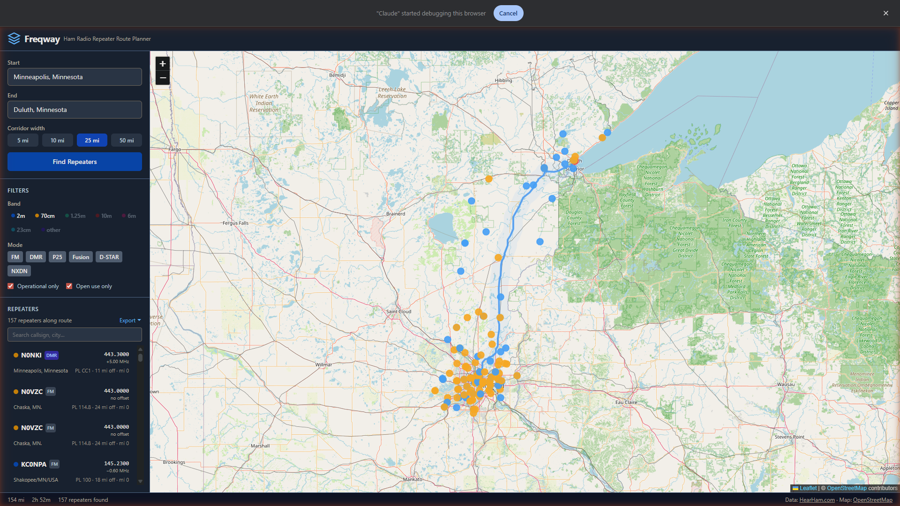
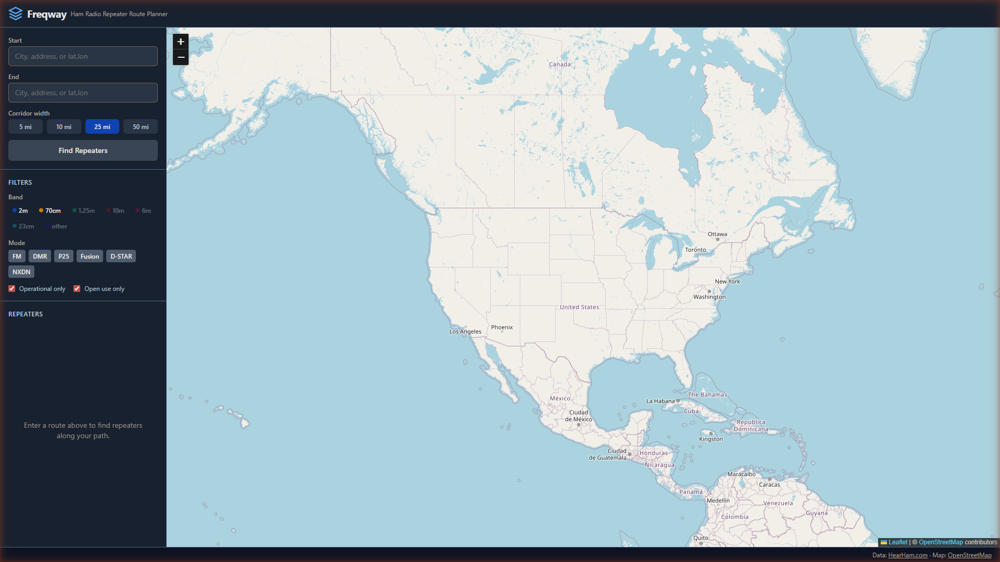
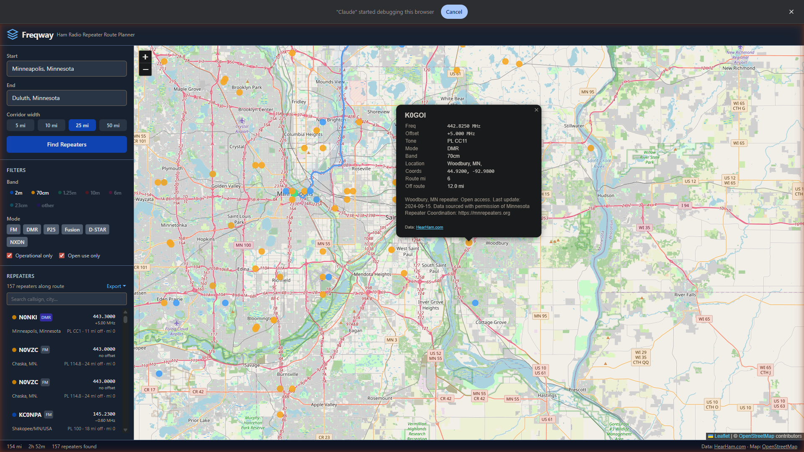
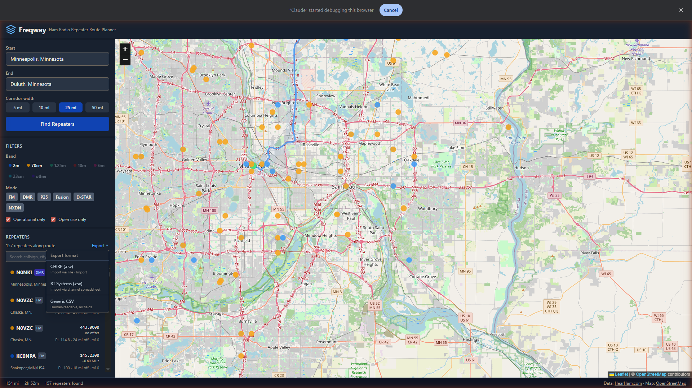

# Freqway — Ham Radio Repeater Route Planner

[](https://vercel.com/new/clone?repository-url=https://github.com/nreed97/freqway)

Plan a driving route and instantly find every repeater along the way, sorted start-to-end so the next machine you need is always at the top of the list.



---

## Features

- **Route-aware search** — enter any two cities, addresses, or lat/lon pairs and get all repeaters within a configurable corridor (5 / 10 / 25 / 50 mi)
- **Sorted by route mile** — list goes start → end so you never scroll the wrong direction mid-drive
- **Band & mode filters** — toggle 2m, 70cm, 1.25m, 10m, 6m, 23cm and FM / DMR / P25 / Fusion / D-STAR / NXDN independently
- **Map integration** — colored dots by band; click any dot or list row to see full details and pan the map
- **Export to radio** — one-click CSV export for CHIRP, RT Systems, or a generic human-readable format
- **Fast** — repeater database cached locally for 24 hours; subsequent searches skip the download entirely
- **No API key required** — data sourced from [HearHam.com](https://hearham.com) (13 000+ US repeaters)

---

## Screenshots

### Empty state



### Route loaded with repeaters

157 repeaters found along Minneapolis → Duluth at a 25 mi corridor width, sorted by route mile:


### Repeater popup

Click any dot on the map to see frequency, offset, tone, mode, band, coordinates, and position along the route:



### Export menu

Export the visible repeater list directly to your radio programming software:



---

## Deploy to Vercel (recommended)

Vercel is free for personal projects and deploys automatically on every push.

1. **Fork or clone** this repo to your GitHub account
2. Go to [vercel.com](https://vercel.com) and sign in with GitHub
3. Click **Add New › Project**, find `freqway`, and click **Import**
4. Leave all settings at their defaults — Vercel auto-detects Vite
5. Click **Deploy**

That's it. Vercel handles the HearHam API proxy via `vercel.json` automatically, so no environment variables or extra config are needed.

> **One-click deploy:** click the button at the top of this README to clone + deploy in one step.

### Netlify

1. Push this repo to GitHub
2. Go to [netlify.com](https://netlify.com) › **Add new site › Import an existing project**
3. Connect your GitHub repo
4. Set **Build command** to `npm run build` and **Publish directory** to `dist`
5. Add a `public/_redirects` file (see below) for the API proxy, then deploy

```
# public/_redirects
/api/hearham  https://hearham.com/api/repeaters/v1  200
```

---

## Local development

```bash
git clone https://github.com/nreed97/freqway.git
cd freqway
npm install
npm run dev
```

Open [http://localhost:5173](http://localhost:5173). The Vite dev server proxies the HearHam API automatically — no extra config needed locally.

### Build for production

```bash
npm run build
# output in dist/
```

---

## How it works

1. **Geocoding** — start/end addresses resolved via the [Nominatim](https://nominatim.org) API (OpenStreetMap)
2. **Routing** — driving route fetched from the [OSRM](https://project-osrm.org) demo server
3. **Repeater data** — full US repeater list fetched from [HearHam.com](https://hearham.com/api/repeaters/v1) and filtered to callsigns starting with K, N, or W (exclusive US amateur allocations)
4. **Corridor filter** — each repeater is projected onto the closest point of the route polyline; repeaters within the chosen corridor width are kept and annotated with route mile and distance off-route
5. **Caching** — the ~13 000-repeater dataset is stored in `localStorage` with a 24-hour TTL so only the first search per day hits the network

---

## Export formats

| Format | Filename | Import method |
|---|---|---|
| CHIRP | `freqway-chirp.csv` | File › Import Data and Settings |
| RT Systems | `freqway-rtsystems.csv` | Open as channel spreadsheet in ADMS / ARCP / CS-series |
| Generic CSV | `freqway-repeaters.csv` | Any spreadsheet app |

Exports include only the repeaters currently visible (active band/mode filters are respected).

---

## Tech stack

- [React](https://react.dev) + [Vite](https://vitejs.dev)
- [Tailwind CSS](https://tailwindcss.com)
- [React Leaflet](https://react-leaflet.js.org) / [Leaflet](https://leafletjs.com) with [OpenStreetMap](https://www.openstreetmap.org) tiles
- Repeater data: [HearHam.com](https://hearham.com)
- Routing: [OSRM](https://project-osrm.org)
- Geocoding: [Nominatim](https://nominatim.org)

---

## User guide

Click the **Help** button in the top-right corner of the app for step-by-step instructions, or read on:

### 1 — Enter your route

Type a city, address, or `lat,lon` in the **Start** and **End** fields. Autocomplete suggestions appear as you type — click one to confirm. Select a **Corridor width** (how far off the highway to search) then press **Find Repeaters**.

### 2 — Read the list

Repeaters appear sorted **start → end** by route mile. Each row shows:

- **Colored dot** — band (blue = 2m, amber = 70cm, green = 1.25m, red = 10m, pink = 6m, cyan = 23cm, purple = other)
- **Callsign** and mode badge
- **Frequency** and offset
- **Tone** (PL/CTCSS or DCS code)
- **Distance off route** and **route mile marker**

Use the search box to filter by callsign or city name.

### 3 — Interact with the map

Click any dot on the map or any row in the list to open the detail popup. Selecting from the list pans the map automatically. Click the same item again to deselect.

### 4 — Filter

Toggle **bands** and **modes** in the Filters panel. Use **Operational only** to hide machines marked offline and **Open use only** to hide members-only repeaters.

### 5 — Export

Click **Export ▾** above the list, choose a format, and the file downloads immediately. Load it into CHIRP or RT Systems to program your radio before you leave.

---

## License

[GLWT](LICENSE) — Good Luck With That

Data from [HearHam.com](https://hearham.com) is used with gratitude. Map tiles © [OpenStreetMap](https://www.openstreetmap.org/copyright) contributors.
